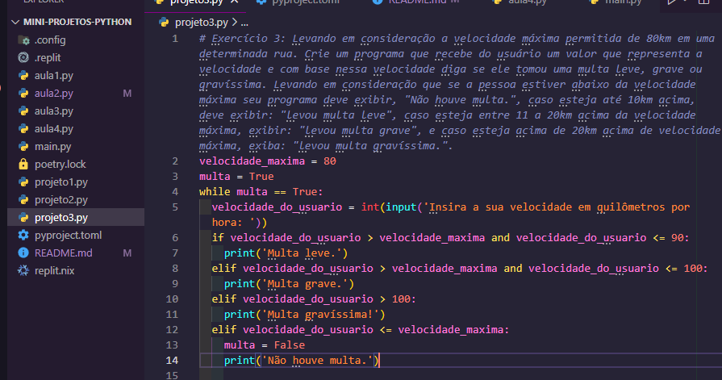

# Introdução ao Python

Este repositório é um guia introdutório para programação em Python. Se você é um iniciante na linguagem Python ou deseja revisar os conceitos básicos, este é o lugar certo para começar. O conteúdo deste repositório abrange os seguintes tópicos:

## Imagem do Arquivo

## Variáveis

Nesta seção, você aprenderá sobre variáveis em Python. Serão abordados os seguintes tópicos:

- Números: como trabalhar com números inteiros e de ponto flutuante.
- Valores Booleanos: como usar valores verdadeiros e falsos em Python.
- Strings: como manipular texto em Python.

## Utilização de Variáveis em um Programa Real

Nesta seção, você verá exemplos de como as variáveis são usadas em um programa real. Serão abordados tópicos como cálculos de valores, entrada de dados do usuário e exibição de resultados.

## Condicionais

Nesta seção, você aprenderá sobre condicionais em Python. Serão abordados os seguintes tópicos:

- `if`, `elif` e `else`: como usar estruturas condicionais para executar diferentes blocos de código com base em condições.

## Laços de Repetição + Listas

Nesta seção, você aprenderá sobre laços de repetição e listas em Python. Serão abordados os seguintes tópicos:

- `for`: como usar o laço `for` para repetir um bloco de código várias vezes.
- Listas: como armazenar e acessar conjuntos de valores em Python.

## Coleções (Listas)

Nesta seção, você aprenderá sobre coleções em Python, com foco em listas. Serão abordados os seguintes tópicos:

- Listas: como criar e manipular listas em Python.

## Exercícios

Nesta seção, você encontrará alguns exercícios para praticar os conceitos que aprendeu ao longo do guia introdutório. Os exercícios abrangem diferentes áreas, como cálculos matemáticos, adivinhação de números e tomada de decisões com base em condições.

Sinta-se à vontade para explorar este repositório, revisar os conceitos e resolver os exercícios. Espero que este guia introdutório seja útil para você iniciar sua jornada na programação em Python. Divirta-se codificando!

## Contribuições

Contribuições são sempre bem-vindas! Se você tiver sugestões de melhorias, correções de erros ou novos exemplos de código, fique à vontade para abrir uma solicitação de pull. Vamos tornar este guia ainda melhor juntos!

Se você tiver alguma dúvida ou precisar de ajuda, não